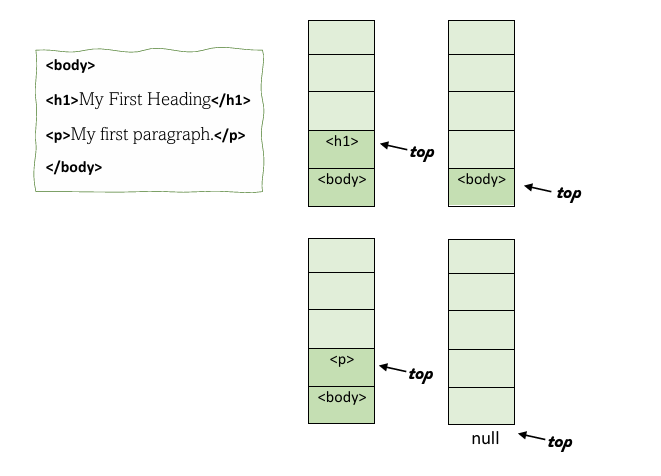
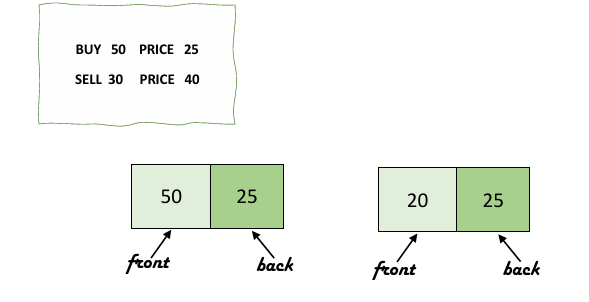

# **Data Structures - Assignment 1**

**AUEB | Fall Semester 2021-2022 | Instructor: E. Markakis** 

## Τhe instructions for the assignment

###### (the instructions have been translated from greek to english and only the parts that we considered relevant were kept in this .md file)

The purpose of this assignment is to familiarize students with basic abstract data types (ADTs) such as stacks and FIFO queues. The assignment consists of 2 ADT implementations (Part A) and 2 applications (Part B and C). Please read the assignment instructions and requirements carefully.

### Part A

The interfaces `StringStack` and `IntQueue` are provided, which declare the basic methods for a stack and a FIFO queue, with elements of type `String` and `int`, respectively. Create an implementation of the `StringStack` and `IntQueue` ADTs, i.e., write 2 classes that implement the 2 interfaces.

**Implementation Guidelines:**

* Your classes must be named `StringStackImpl` and `IntQueueImpl`.
* The implementation for both interfaces must be done using a singly linked list (i.e., the stack and queue must store their contents in a singly linked list).
* Each method for inserting or removing elements must complete in O(1) time, meaning it should run in constant time, independent of the number of items in the queue. Similarly, the `size` method should also execute in O(1).
* When the stack or queue is empty, methods that attempt to read from the structure must throw a `NoSuchElementException`. The `NoSuchElementException` belongs to Java’s core library. Import it from the `java.util` package. Do not create your own exception.
* You may use part of the code that has been presented in the course labs (available on eclass), write your own list from scratch, or define only `Node` objects within the queue class for the list's nodes without defining a list class. To gain a better understanding, we recommend starting from scratch and writing your own classes (you won't lose any points, however, by using what you’ve seen in the lab).
* It is not required to have a `main` method in the files you submit for Part A. However, it is a good idea to create a `main` method where you can run some examples to verify the correctness of your methods (your `main` method will not be graded, as we will use our own program to evaluate the implementations of the interfaces).
* You are not allowed to use ready-made implementations of list, stack, and queue structures from the Java library (e.g., `Vector`, `ArrayList`, etc.).

### Part B

Using the stack implementation from Part A, write a client program that will check for matching tags in an HTML file. In every HTML document, tags delimit sections of text. An opening tag looks like `<tag_name>`, while the corresponding closing tag is `</tag_name>`. Some simple and common tags are as follows:

* `body`, to start the main body of the document
* `h1`, for the header
* `center`, for center alignment
* `ol`, for a numbered list of items
* `li`, for an item in a list

Ideally, each HTML document has matching tags; that is, if there is a `
` tag somewhere in the file, the corresponding closing tag `
` must appear later in the file, marking the end of the center alignment. The same should happen for all tags. Additionally, if there are nested tags within a file, they must close in the correct order. If we have nested opening tags, the last opened tag must be the first one to close before the others. Although many browsers tolerate the presence of some unmatched tags, we want to avoid such tags in the files we process.

The client program you will write should read an HTML file line by line, with the file name provided by the user, and determine at the end if the file has matching tags or not, printing the corresponding message.

**Implementation Guidelines:**

* Your program should be named `TagMatching.java`.
* You should use the stack implementation from Part A.
* For reading the HTML file, you can use existing Java classes, such as `Scanner`, `FileReader`, `BufferedReader`, etc. You can also use built-in methods to process `String` variables. However, aside from reading the file, the rest of the program should use the stack to determine the matching of tags.
* Your assignment will be evaluated on HTML files with simple opening and closing tags, like those mentioned above. For example, you don’t need to worry about tags like `<a href="http://...">link</a>`. Also, you don’t need to check whether the HTML file has other syntax errors; focus only on tag matching. Additionally, you do not need to check whether the HTML file has other syntax errors. Focus only on the matching of tags.
* Your program must have a `main` method, and the path to the HTML file to be checked should be passed as a command-line argument during the execution of your program (use `args[0]` in the `main` method). The program should be executable either from the command line with a command or from your IDE .

### Part C

Using the FIFO queue implementation from Part A, write a client program that solves the following accounting problem: when calculating the net profit from the sale of shares, there is ambiguity as to which shares are considered sold (when we have shares purchased at different prices). For example, suppose that at time t1, we purchased 50 shares of a company at a price of 25 euros. Later, at time t2, we purchased another 40 shares of the same company at a price of 22 euros, and at time t3, we bought another 30 shares at a price of 32 euros. Suppose later we sell 110 shares (out of the 120 we have) at a price of 30 euros. The accounting principle used to determine the net profit of the sale at that time is based on the FIFO protocol. Most investment portfolio management software uses this principle. In our example, this means that of the 110 shares we sell, the first 50 are considered to come from those purchased earlier, i.e., at time t1, the next 40 from those purchased at time t2, and the next 20 from the last purchase. Thus, our net profit at that moment is considered to be:

50 (30 – 25) + 40 (30 – 22) + 20 (30 – 32) = 250 + 320 – 60 = 510

Note that in the above calculation, we do not take into account the 10 shares remaining from the 120 that we did not sell (these will be taken into account in future sales).

Write a program that will read from a `.txt` file a sequence of successive transactions in the following format:

buy 50 price 25
buy 40 price 22
buy 30 price 33
sell 110 price 30
buy 25 price 35
sell 30 price 40
...

and will print the total net profit or loss that results immediately after the last sale. The above file represents transactions in the order they occur. For example, in this case, there were 3 purchases, then a sale, then another purchase, and then another sale. The file will always start with at least one purchase transaction and will always end with a sale transaction.

**Implementation Guidelines:**

* Your program must be named `NetBenefit.java`.
* For reading the input file, you can use methods similar to those mentioned in Part B. You should then use the FIFO queue implementation from Part A to calculate the net profit.
* We assume that in all lines of the input file, the number of shares and the prices are integers. You do not need to check that all elements in the input file are in the correct format (the assignments will be evaluated on files like the example above). However, you should print an error message if there is a sale of more shares than have been purchased up to that point (e.g., if it starts with a sale transaction).
* The path to the input file will be given as an argument, corresponding to Part B. For example, the execution from the command line should look like this:
  `java NetBenefit path_to_text_file.txt` 

# Our Report:

### Part A

For the implementation of the interfaces, we considered that each interface would create a list that operates either as a queue (IntQueueImpl implementing the given IntQueue and its methods) or as a stack (StringStackImpl implementing the given StringStack and its methods). In each interface, the nodes of the list are implemented with private classes defined within each interface, depending on whether the content required is to be an integer or a string. Our implementation does not use generics.

Regarding the queue implementation, we initially create a private class Node to create objects that function as nodes where integer values will be stored. The `isEmpty` method returns a boolean value of True or False depending on whether the head is empty. The `put` method inserts an element at the tail of the queue, while `get` removes an element and returns it from the head of the queue, first checking that it is not empty; otherwise, an exception occurs. The `peek` method returns the element at the head of the queue if the queue is not empty; otherwise, an exception occurs. The `printQueue` method prints the elements of the queue from head to tail or a message indicating that it is empty. Finally, the `size` method returns the size of the queue, which is updated every time an element is added or removed, ensuring that it completes in O(1) time without having to traverse the queue.

Regarding the stack implementation, the Node class is created so that Node objects store values of type String. The methods `isEmpty`, `peek`, `printStack`, and `size` adapt the same implementation for a stack as the corresponding methods analyzed above for the queue. The `push` method pushes an element onto the top of the stack, while the `pop` method pops the corresponding element, as long as the stack is not empty in both cases.

### Part B

For Part B, we created the file `TagMatching.java`, which uses `StringStackImpl` to create a stack where the corresponding tags of the HTML file will be stored for checking the correctness of the program. We use the instructions given in the statement for command line arguments to provide the file name as input.

We thought that after identifying which words in the HTML file are tags, we should store them each time by pushing them onto the top of the stack we created at the beginning of the code. We check for each tag whether it is an opening tag or a closing tag. Since each tag that opens last must close first, hence the use of a stack with Last In First Out (LIFO) logic, we push each tag we read onto the stack if it is an opening tag. If it is a closing tag, we check whether the last tag pushed onto the top of the stack is the corresponding opening tag. If there is a match, the tag is popped from the top of the stack; otherwise, it is not popped, resulting in the stack never emptying. Thus, we can determine at the end of the program whether the HTML file is correct or not (i.e., whether all opening tags are closed properly).

For Part C, we created the file NetBenefit.java, which uses IntQueueImpl to create a queue where the numerical values from the accounting .txt file will be stored, and it will perform the corresponding calculations. We use the instructions provided in the statement for command line arguments to input the file name.

When each line starts with the word "buy," we add the quantity number and then the price number to a queue that we have created. If the line starts with "sell," this means that the specified quantity of shares (from the shares currently in the queue) will be sold at the price indicated after "price," following the order in which they were entered. Hence, the use of a queue, which operates on a First In First Out (FIFO) basis. After that, the shares sold and their prices are removed from the queue, while we assumed that the remaining shares and their prices should remain.

